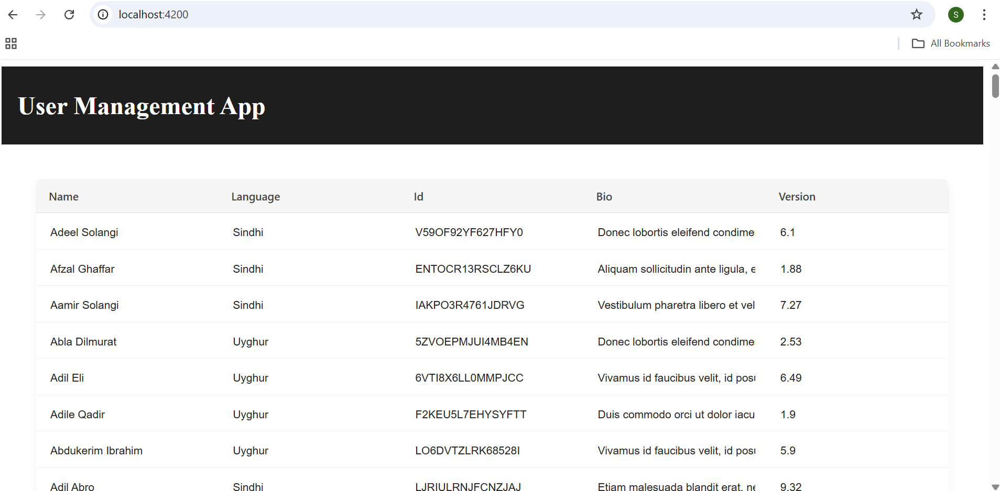
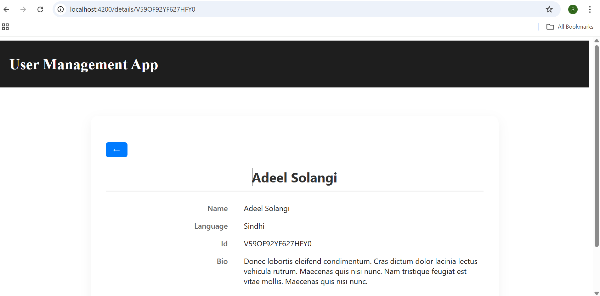
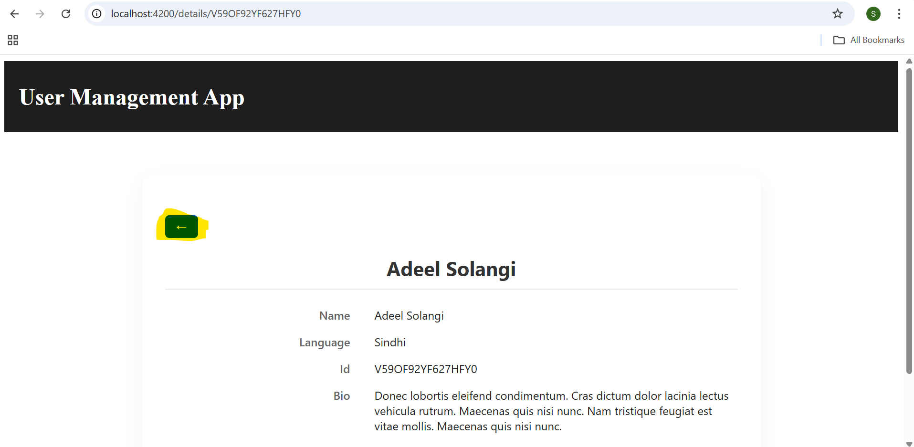
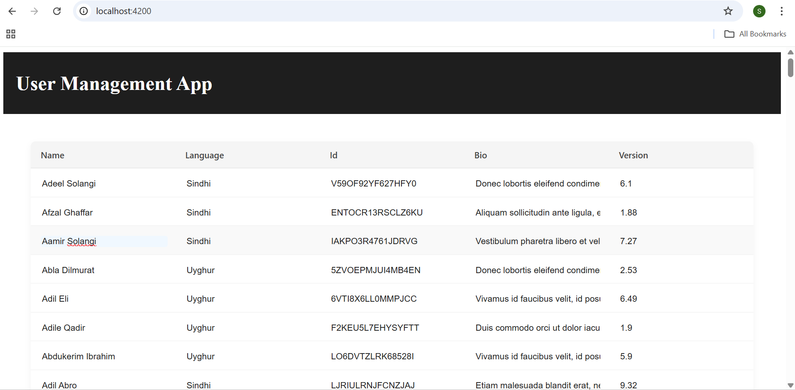

# twisted_mountain_animation_assignment
Assignment for Twisted Mountain Animation

1. On `ng serve`, launch `http://localhost:4200/` which loads the list of users data in a tabular format.

2. On click of row, it loads `http://localhost:4200/details/<userId>` user detail page.

3. Back button in detail page helps to move to tabular page.

4. Data in table can be edited on click of column of table.
